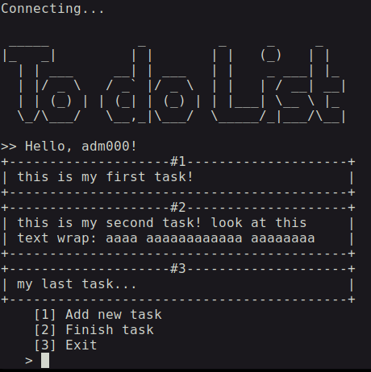

# To Do List
> Umapp to-do-list na linha de comando

## Sobre  
    Esse projeto me ajudou a aprimorar minhas seguintes habilidades:
    - CRUD no PostgreSQL com Java;
    - Design Pattern: Repository Pattern;
    - Autenticação de usuário simples;
    - Desaclopamento de código;
    - Orientação a Objetos;

### Features

- [x] Cadastro/Login de usuário;
- [x] Persistência de dados;
- [x] Adicionar/remover tarefas em tempo real;
- [ ] Rodar em qualquer lugar ( atualmente em banco de dados Local );

### Stack
- [x] Java SE
- [x] JDBC
- [x] PostgreSQL

*** 

## Requisitos

- Java 17+
- PostgreSQL 14+
- Git

### Install

1- `git clone https://github.com/filipemartinsdev/todolist.git`

2- `cd todolist`

### Run
- Trabalhando nisso...

### Showcase

